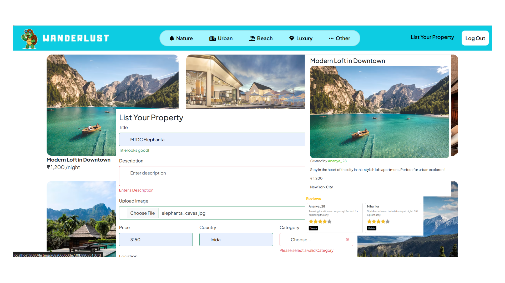

# 🌍 WanderLust

**WanderLust** is a full-stack vacation rental platform built with React and Node.js. Users can browse property listings, leave reviews, manage their own properties, and search by category. Features modern JWT authentication, responsive design, and cloud-based image storage.

---
## 🚀 Live Demo
Check out the live version of the project here: [Wanderlust Live](https://wanderlust-k1mg.onrender.com)



## ✨ Features

* ✍️ **Full CRUD Operations** - Create, read, update, and delete property listings
* ⭐ **Review System** - Star-based ratings (1-5) with comments
* 🔐 **JWT Authentication** - Secure user signup and login
* 🔒 **Authorization** - Only owners can edit/delete their listings and reviews
* 📁 **Category Filtering** - Filter by Urban, Nature, Beach, Luxury, or Other
* ☁️ **Cloudinary Integration** - Optimized image upload and storage
* 📱 **Responsive Design** - Mobile-friendly Bootstrap UI
* ⚡ **Modern Stack** - React with Vite, React Query, and React Router

---

## 📦 Project Structure

```
WanderLust/
├── backend/               # Express REST API Server
│   ├── config/           # Configuration (Cloudinary)
│   ├── controllers/      # Route handlers
│   ├── middleware/       # Auth, validation, error handling
│   ├── models/           # Mongoose schemas
│   ├── routes/           # API routes
│   ├── utils/            # Utility functions
│   ├── .env              # Environment variables
│   ├── package.json
│   └── server.js         # Entry point
│
├── frontend/              # React SPA (Vite)
│   ├── public/           # Static assets
│   ├── src/
│   │   ├── api/          # API client (Axios)
│   │   ├── components/   # React components
│   │   ├── contexts/     # React contexts (Auth, Flash)
│   │   ├── hooks/        # Custom hooks
│   │   ├── pages/        # Page components
│   │   ├── routes/       # Route configuration
│   │   ├── styles/       # CSS files
│   │   ├── utils/        # Utility functions
│   │   ├── App.jsx       # Root component
│   │   └── main.jsx      # Entry point
│   ├── .env.development  # Dev environment vars
│   ├── package.json
│   └── vite.config.js
│
└── README.md
```

---

## 🛠️ Setup Instructions

### Prerequisites
- Node.js (v20.x recommended)
- MongoDB Atlas account
- Cloudinary account

### Backend Setup

1. **Navigate to backend:**
```bash
cd backend
```

2. **Install dependencies:**
```bash
npm install
```

3. **Create `.env` file in backend directory:**
```env
MONGO_URL=your_mongodb_connection_string
CLOUD_NAME=your_cloudinary_cloud_name
CLOUD_API_KEY=your_cloudinary_api_key
CLOUD_API_SECRET=your_cloudinary_api_secret
JWT_SECRET=your_long_random_jwt_secret_key
NODE_ENV=development
FRONTEND_URL=http://localhost:5173
PORT=8080
```

4. **Start the backend server:**
```bash
npm start
```
Backend will run on http://localhost:8080

### Frontend Setup

1. **Open new terminal, navigate to frontend:**
```bash
cd frontend
```

2. **Install dependencies:**
```bash
npm install
```

3. **Start the development server:**
```bash
npm run dev
```
Frontend will run on http://localhost:5173

---

## 🧪 Testing the Application

### 1. Access the Application
Open http://localhost:5173 in your browser

### 2. Test User Authentication
- Click **"Sign Up"** → Create account (username, email, password)
- After signup, you'll be automatically logged in
- Test **"Log Out"** and **"Log In"** with your credentials

### 3. Test Listing Creation
- Click **"List Your Property"** in navbar
- Fill in all required fields:
  - Title, Description
  - Upload an image (jpg, png, jpeg)
  - Price, Country, Category, Location
- Submit and verify listing appears on homepage

### 4. Test Listing Details
- Click any listing card
- Verify: listing details, owner name, reviews section
- If you're the owner: Edit and Delete buttons should appear

### 5. Test Reviews
- On listing details page, scroll to reviews
- Select star rating (1-5 stars)
- Enter comment and submit
- Verify review appears with your username

### 6. Test Category Filtering
- Click category links in navbar (Nature, Urban, Beach, etc.)
- Verify only matching listings are displayed

### 7. Test Edit/Delete
- On your own listing, click **"Edit"**
- Modify fields, optionally upload new image
- Save and verify changes
- Test **"Delete"** (with confirmation dialog)

### 8. Test Authorization
- Try accessing `/listings/new` without login → Should redirect to login
- After login, should redirect back to create listing
- Try editing someone else's listing → Should not see Edit/Delete buttons

---

## 🔌 API Endpoints

### Authentication
```
POST   /api/auth/signup        # Register new user
POST   /api/auth/login         # Login user (returns JWT)
GET    /api/auth/me            # Get current user (protected)
POST   /api/auth/logout        # Logout user
```

### Listings
```
GET    /api/listings                    # Get all listings
GET    /api/listings/:id                # Get single listing
POST   /api/listings                    # Create listing (protected)
PUT    /api/listings/:id                # Update listing (protected, owner only)
DELETE /api/listings/:id                # Delete listing (protected, owner only)
GET    /api/listings/category/:category # Get listings by category
```

### Reviews
```
POST   /api/listings/:id/reviews           # Create review (protected)
DELETE /api/listings/:id/reviews/:reviewId # Delete review (protected, author only)
```

---

## 🚀 Tech Stack

### Backend
- **Node.js** & **Express.js** - Web server
- **MongoDB** & **Mongoose** - Database
- **JWT** - Authentication
- **Bcrypt** - Password hashing
- **Cloudinary** - Image storage
- **Multer** - File upload handling
- **Joi** - Validation

### Frontend
- **React 18** - UI library
- **Vite** - Build tool
- **React Router v6** - Routing
- **React Query** - Server state management
- **React Hook Form** - Form handling
- **Axios** - HTTP client
- **Bootstrap 5** - UI framework
- **Font Awesome** - Icons

---

## 🐛 Troubleshooting

**Backend not starting:**
- Verify MongoDB connection string
- Check all environment variables are set
- Ensure port 8080 is available

**Frontend not loading listings:**
- Verify backend is running on port 8080
- Check browser console for errors
- Verify VITE_API_URL in `.env.development`

**Image upload not working:**
- Verify Cloudinary credentials
- Check file type (jpg, png, jpeg only)
- Verify Multer configuration

**Authentication issues:**
- Clear localStorage in browser
- Verify JWT_SECRET is set in backend .env
- Check token hasn't expired (7 days default)

---

## 🤝 Contributions & Issues

Feel free to contribute or raise issues to help improve **WanderLust**.
Every contribution makes a difference!

